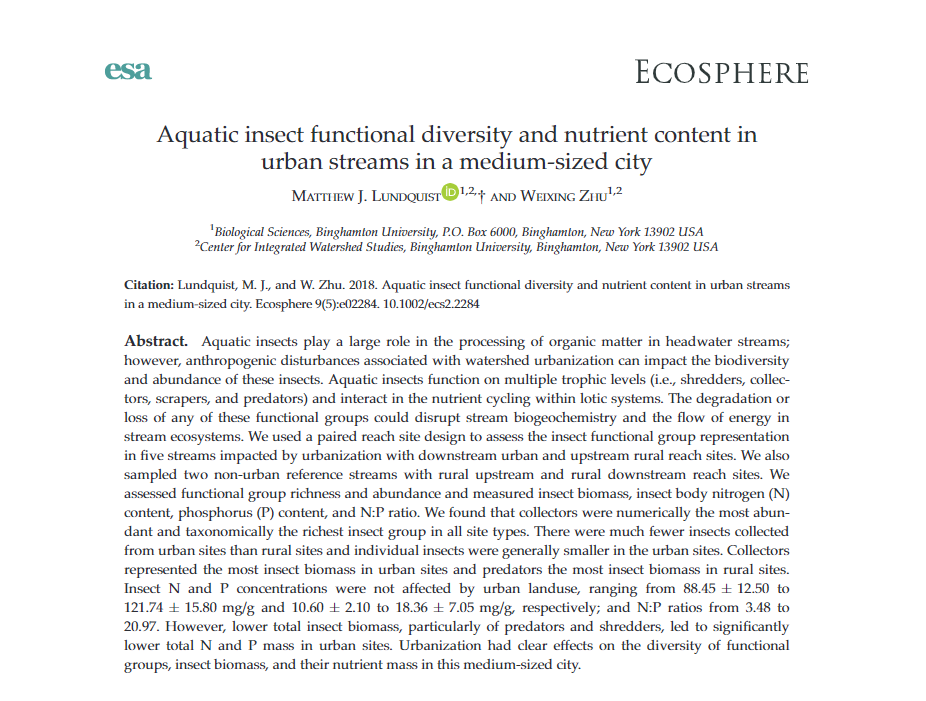

Data and example data analysis techniques in R. 

Original paper: [Aquatic insect functional diversity and nutrient content in urban streams in a medium‐sized city](https://esajournals.onlinelibrary.wiley.com/doi/full/10.1002/ecs2.2284)

Companion dataset: [https://github.com/lundquist-ecology-lab/urban_aquatic_insects](https://github.com/lundquist-ecology-lab/urban_aquatic_insects)